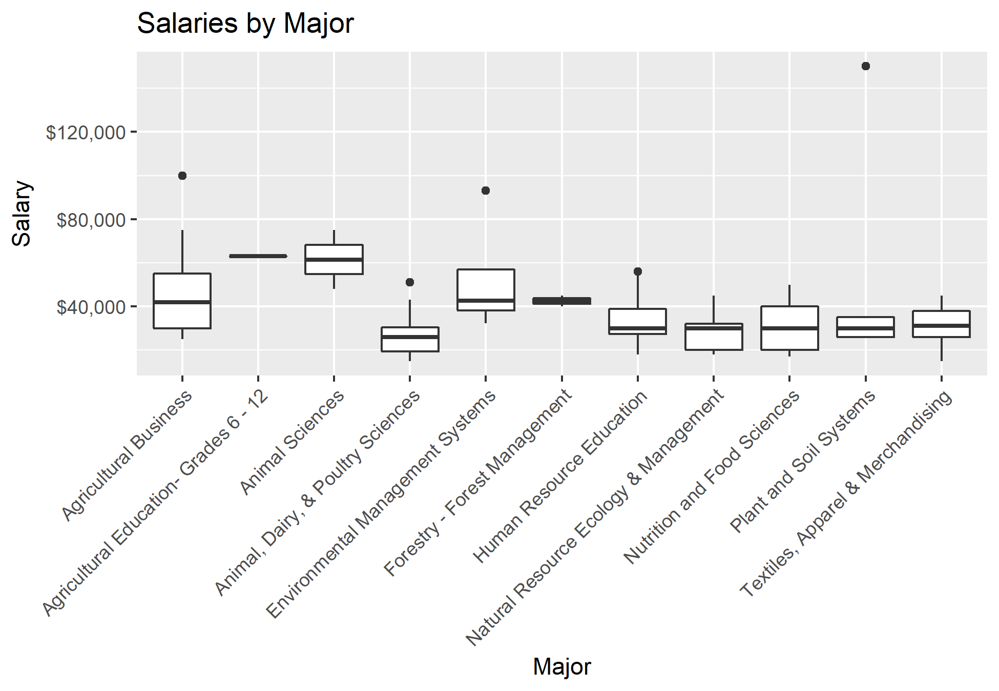
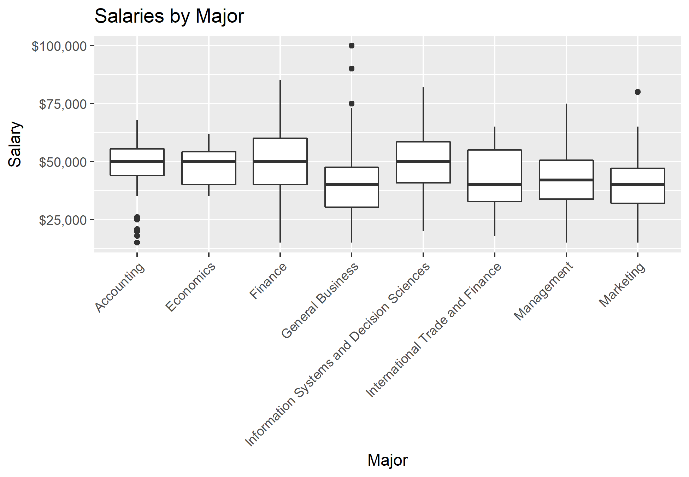
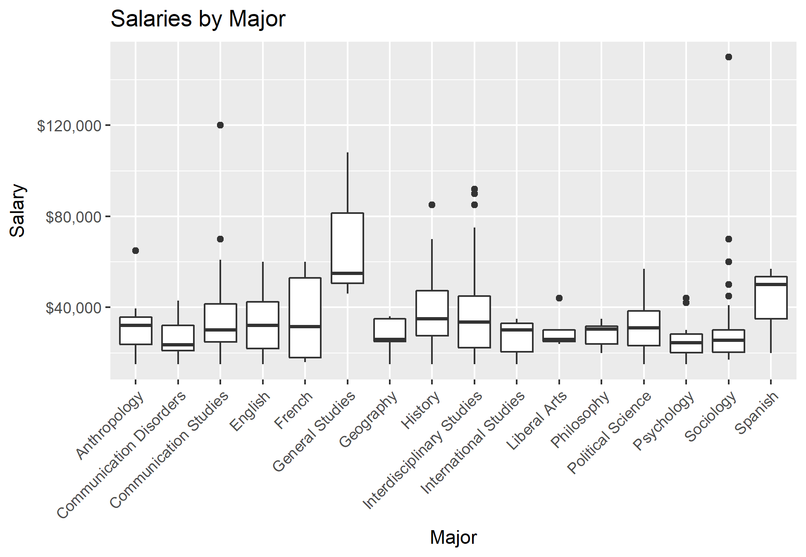
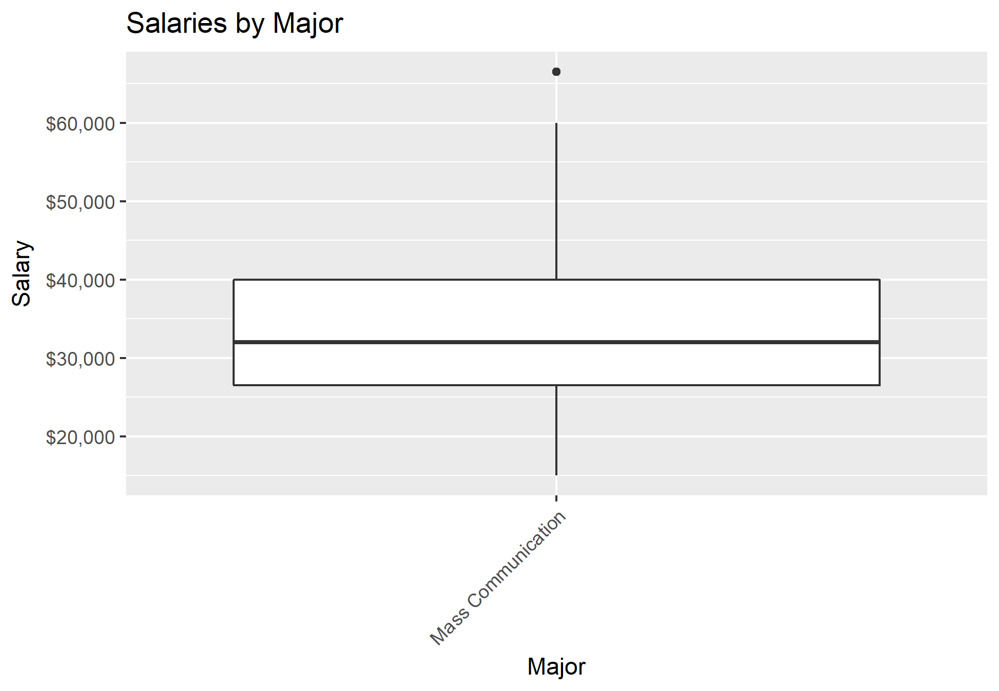
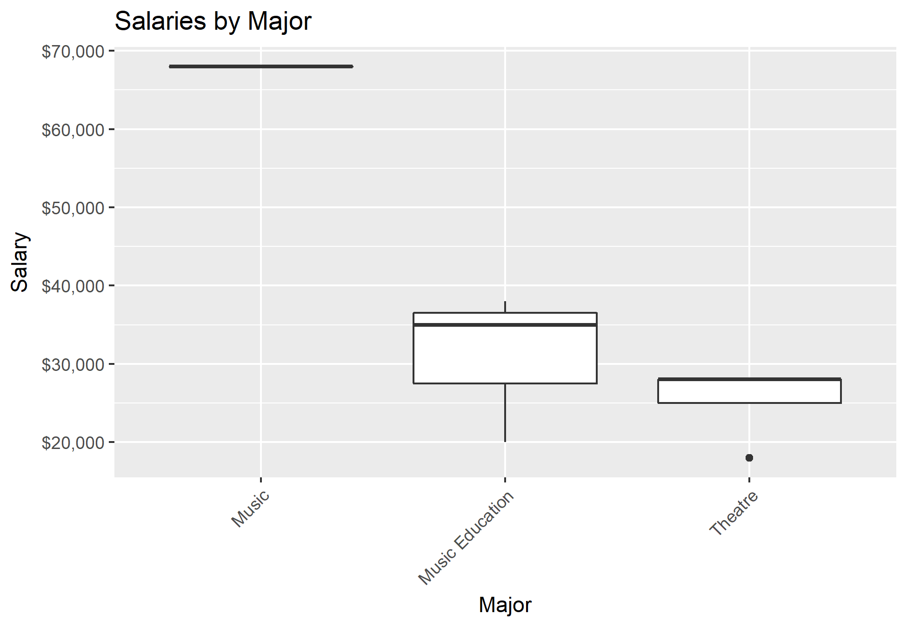
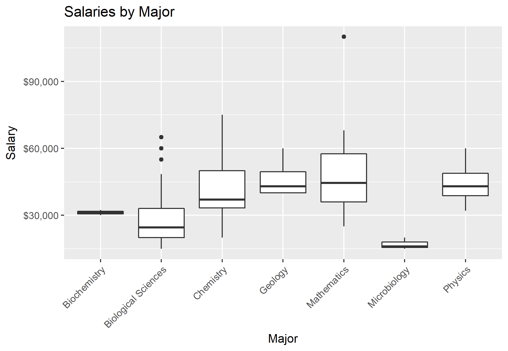

```{r setup, include=FALSE}
knitr::opts_chunk$set(echo = FALSE, message = F)
library(tinytex)
library(tidyverse)
library(knitr)
library(DBI)
library(scales)

source("conn.R")
source("salaryBrackets.R")
source("StudentInternships.R")


#I'll come back and lessen the narrative before turning in the project, but just so everyone is on the same page for the time being, I want us to keep the explanations until finished.
```

#Introduction to Analysis
Our team conducted an anaylysis to determine how an LSU graduate's past internships affect their starting salary after graduation, if at all. 

Our original hypothesis inferred that students who had participated in an internship prior to graduation would be amongst those who have a higher starting salary.

###Steps for Process

We first compared the starting salaries for those accepted full time against 3 different indicators:
- if the graduate had a previous internship
- the compensation (paid or unpaid) of the internship they had
- if the graduate stayed with that company

Then, we broke down the salary performance statistics we found by LSU Majors against that of the national average from a national study conducted by the Wall Street Journal, "Majors That Pay Back".

```{r}
graduation <- tbl(conStudent, 'graduation') %>% collect()
internship <- tbl(conStudent, 'internship') %>% collect()
organization <- tbl(conStudent, 'organization') %>% collect()
currPosition <- tbl(conStudent, 'currentPosition') %>% collect()
fulltime <- tbl(conStudent, 'fulltime') %>% collect() 
employment <- tbl(conStudent, 'employment') %>% collect()


```

#Results
###Number of Internships

Of all of the LSU graduates from 2017, there was a total of `r sum(internGrad$interns)` completed internships, with some students completing as many as 4. (do max for this) 

[Inchan part for how many studnets completed # of internships]

The total number of students who completed internships were `r percent(length(internGrad$interns)/length(graduation$graduationId))` of the graduating class.

[inchan put students who didn't]
There were `r count(noInterns)` students who did not have internships, which is about 13 people without an internship for every 1 with an internship.

```{r}
right_join(internship, graduation, by = 'graduationId') %>%
  select(graduationId, internshipId) %>% mutate(interns = !is.na(internshipId)) %>%
  count(graduationId, interns) %>% mutate(interns = interns*n) %>% 
  select(graduationId, interns) %>% collect() -> xxx

right_join(internship, graduation, by = 'graduationId') %>%
  select(graduationId, internshipId) %>% mutate(interns = !is.na(internshipId)) %>% 
  count(interns) %>% collect() -> yyy
yyy$interns <- factor(yyy$interns, levels = c("0","1"), labels = c("No", "Yes"))
yyy

right_join(internship, graduation, by = 'graduationId') %>%
  select(graduationId, internshipId) %>% mutate(interns = !is.na(internshipId)) %>%
  select(graduationId, interns) %>% filter(interns != T) -> noInterns

yyy %>% 
  ggplot() +
  geom_col(aes(x = interns, y = n)) -> yGraph
yGraph

xxx %>% 
  ggplot() +
  geom_bar(aes(interns)) -> xGraph
xGraph

xxx %>% collect() %>%  right_join(yy, by = "graduationId") %>% 
  ggplot() +
  geom_bar(aes(x = interns, fill = salaryBracket), position = "dodge") +
  ggtitle(label = "Internships")

xxx %>% collect() %>%  inner_join(yy, by = "graduationId") %>% inner_join(majors, by = "graduationId")
```


###Paid or Unpaid Internships
```{r}

graduat <- tbl(conStudent,'graduation')
graduat1 <- as_data_frame(graduat)
graduat1
graduat <- tbl(conStudent,'graduation')
graduat1 <- as_data_frame(graduat)

intern <- tbl(conStudent,'internship')
intern1 <- as_data_frame(intern)

oo <- intern1 %>% inner_join(graduat1) %>% count(internshipPaid) %>% 
  filter(!is.na(internshipPaid))

paid<- tbl(conStudent,'internship') %>% inner_join(tbl(conStudent,'graduation')) %>% select(graduationId,internshipPaid)

total<- tbl(conStudent,'internship') %>% inner_join(tbl(conStudent,'graduation')) %>% select(graduationId,jobTitle,internshipPaid)%>% count(internshipPaid) %>% 
  filter(!is.na(internshipPaid))

internshipP <- paid %>% collect() 

tn <- oo %>% filter(internshipPaid== "no")
ty <- oo %>% filter(internshipPaid== "yes")
```
As we have stated previously, of all of the LSU graduates from 2017, `r length(unique(intern1$graduationId))` graduates had internships while completing their degree.  

From this number there is a total of `r oo[1,2]` unpaid internships, and `r oo[2,2]` paid internships taken by students that graduated in 2017.  

In this analysis we will find out about the correlation between paid and unpaid internship on the starting salaries for graduated students in 2017.  

```{r}
paidcol <- tbl(conStudent,'internship') %>% inner_join(tbl(conStudent,'graduation')) %>% select(graduationId,jobTitle,internshipPaid)%>% count(internshipPaid) %>% 
  filter(!is.na(internshipPaid)) %>% collect() %>% 
  ggplot()+
  geom_col(aes(internshipPaid, n), fill = 'purple')
paidcol

##maybe color the columns - we could go with a purple/gold color scheme - pey

```

```{r}
kk <- paid %>% collect() %>% right_join(yy, by = "graduationId") %>%  filter(!is.na(internshipPaid)) %>% select(salaryBracket, internshipPaid) %>% count(salaryBracket, internshipPaid)%>% mutate(percentage = percent(round(n/2099, digits = 3)))

```

From the dataset we found out that `r sum(kk$n)` get a job right after graduation. The distribution based on the salary bracket is :

* `r kk[1,3]` graduates with unpaid internships, and `r kk[2,3]` graduates with paid internships got low starting salaries.
* `r kk[3,3]` graduates with unpaid internship, and `r kk[4,3]` graduates with paid internship got medium starting salaries.
* `r kk[5,3]` graduates with unpaid internship, and `r kk[6,3]` graduates with paid internship got high starting salaries.

```{r}
paidbar <- paid %>% collect() %>% right_join(yy, by = "graduationId") %>%  filter(!is.na(internshipPaid)) %>% 
  ggplot() + geom_bar(aes(x = internshipPaid, fill = salaryBracket), position = "dodge") + scale_fill_discrete(guide_legend(title = "Salary Bracket")) 
paidbar
```

Based on data and graph above we can coclude that paid internship have highly positive correlation on starting salary with the overwhelming majority of `r kk[6,4]` beginning with a high starting salary, and second highest number with `r kk[4,4]` for medium starting salary, making up more than half of those who had an internship. 

Based on data and graph above we can coclude that paid internship have highly positive correlation on starting salary with the highest percentage of `r kk[6,4]` for high starting salary, and second highest of `r kk[4,4]` for medium starting salary. 

###Internship Turnovers

```{r}
## I have new code I'm goign to insert soon
```

###How LSU Graduates Stack Up
To put everything in perspective, we wanted to compare the starting salaries of LSU graduates to that of the average college graduate in the US. To do this, we used a dataset from *The Wall Street Journal* (WSJ) that included the median starting salaries of college graduates by major: http://online.wsj.com/public/resources/documents/info-Degrees_that_Pay_you_Back-sort.html.  
Of the `r nrow(kaggle)` majors listed in the WSJ dataset, only `r nrow(kaggle) - nrow(notIn)` matched up with the majors of the LSU graduates who went into the workforce after graduation. Some of the major names had to be adjusted to match up properly to the WSJ dataset.  

The changes that were made:

LSU | WSJ
---------------------------------------- | --------------------------------------
biological sciences | biology
management | business management
theatre | drama
fine arts - art history | art history
construction management | construction
forestry - forest management | forestry
information systems and decision sciences | management information systems (mis)
mathematics | math
nutrition and food sciences | nutrition
international studies | international relations

Also :

* `r grep("edu", majorList$majorName, value = T)` were changed to **education**
* agricultural business, agricultural economics were changed to **agriculture**
* `r grep("mass communication", majorList$majorName, value = T)` were changed to **mass communication**

```{r}
salaryPlot
```

There are `r length(unique(all$majorName))` majors listed in this graph, so it might be hard to tell which is which. We've broken it down into two graphs instead.

```{r}
higherPlot
lowerPlot
```

As you can see, there are `r length(unique(higher$majorName))` LSU majors that pay equal to or higher than the national median and `r length(unique(lower$majorName))` LSU majors that pay less than the national median.

Some majors have a wider range of salaries than others, so we have included box-and-whisker plots at the end of this report for each major.

#Conclusion


#Salary Box-and-Whisker Plots

```{r}
#source("boxPlotMaker.R")
```















